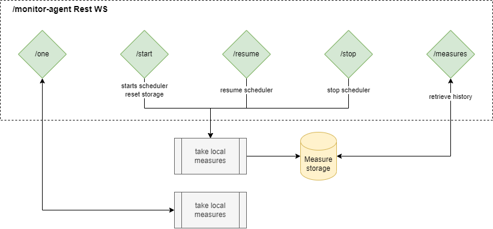

# Monitor Agent

Web Service for system resources monitoring

**Must use JDK >= 14**

A Rest Web Service is exposed on 3000 port, with these given routes:
* `/monitor-agent/one` - retrieve a one-time measurement
* `monitor-agent/start` - starts scheduled measurement. A measure is taken every 5 seconds
* `monitor-agent/stop` - stops the scheduled measurements
* `monitor-agent/resume` - resume the scheduled measurements
* `monitor-agent/measures` - retrieved stored measurements in CSV format




## Build

* From project root dir (using Maven):
`mvn clean install`

OR

* From IntelliJ, use `Build Jar` configuration

Final jar is build in `/target` folder

## Usage
`java -jar monitor-agent-1.0.0`


### Exemple d'appel

`GET http://localhost:3000/monitor-agent/one`
```json
{
    "agent": "PO1",
    "date": "18/02/2022 10:00:15",
    "system": {
        "arch": "amd64",
        "version": "10.0",
        "name": "Windows 10"
    },
    "cpu": {
        "availableProcessors": 8,
        "cpuLoad": 0.10738270715756429,
        "cpuAverageLoad": 0.10738270715756429
    },
    "process": {
        "processCpuLoad": 0.10738270715756429,
        "processCpuTime": 9078125000,
        "processAllocatedMemory": 38132944,
        "processTotalMemory": 4215275520,
        "processPresumableFreeMemory": 4177142576,
        "processMemoryLoad": 0.00904637
    },
    "memory": {
        "committedVirtualSize": 231067648,
        "totalSwapSize": 29742899200,
        "freeSwapSize": 15672004608,
        "freeMemory": 5554331648,
        "totalMemory": 16857997312
    }
}
```

## Measure Object

| Path         | Description     | Example |
|--------------|-----------|------------|
| agent | Name of the local agent      | Agent01        |
| date      | Date of the mease. dd/mm/yyyy hh:mm:ss  | 18/02/2022 10:00:15       |
| system | Information relative to the local system | |
| system.arch | System architecture | amd64
| system.version | Version of the operating system | 10.0 |
| system.name | Name of the operating system | Windows 10
| cpu |Informations relative to CPU | | 
| cpu.availableProcessors |Number of available processors | 8 |

